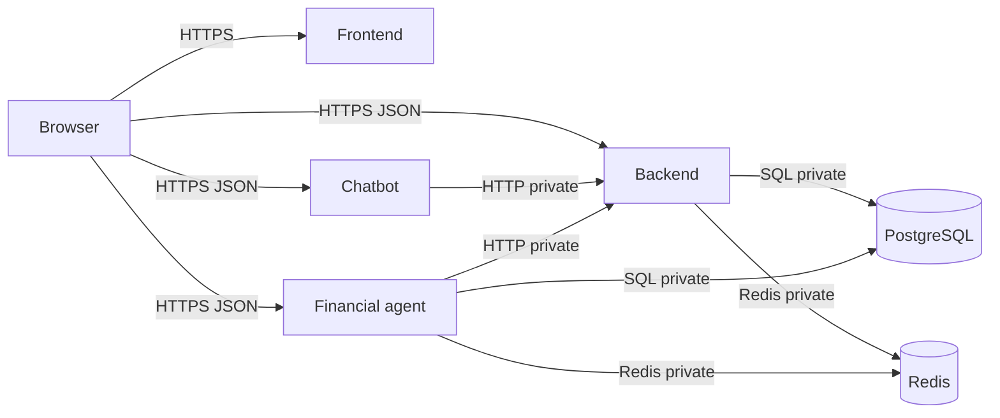
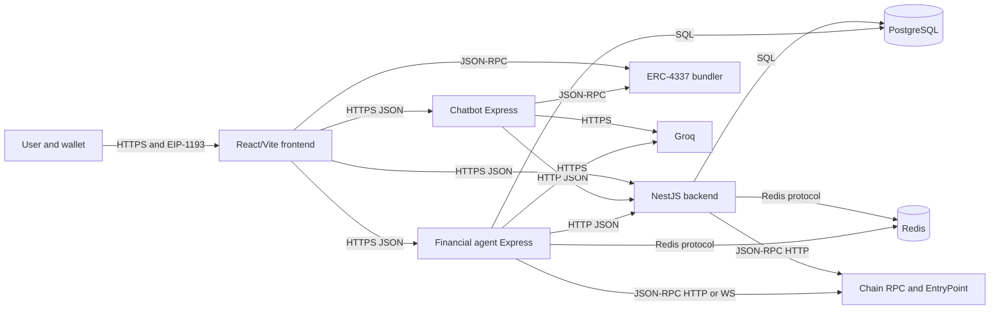
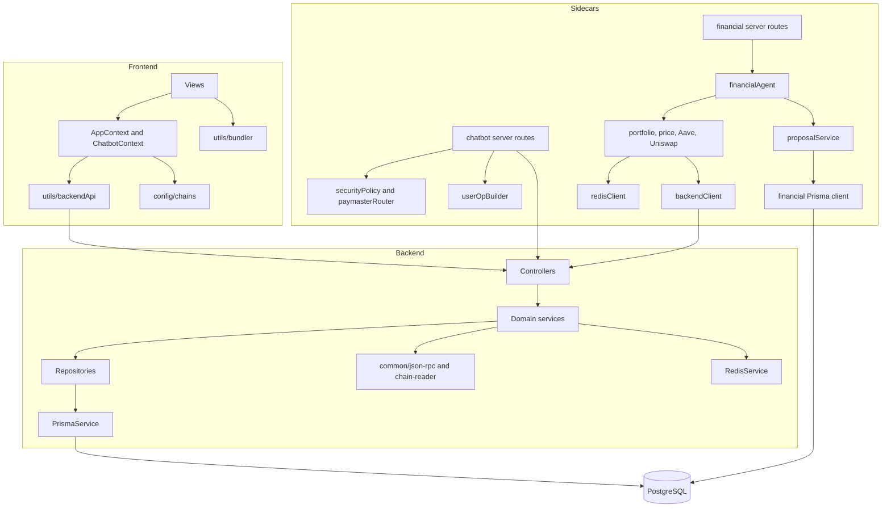
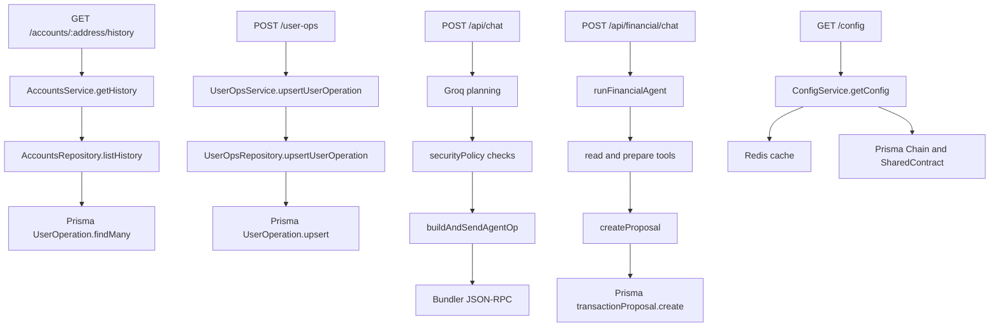
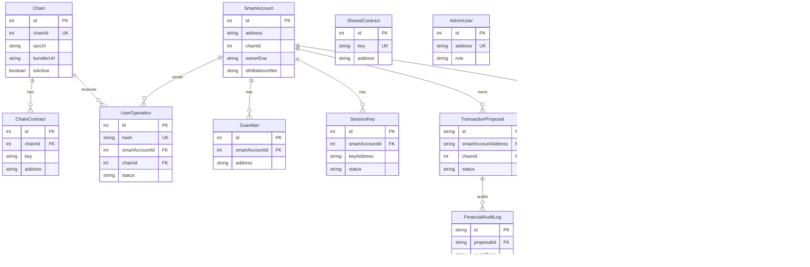
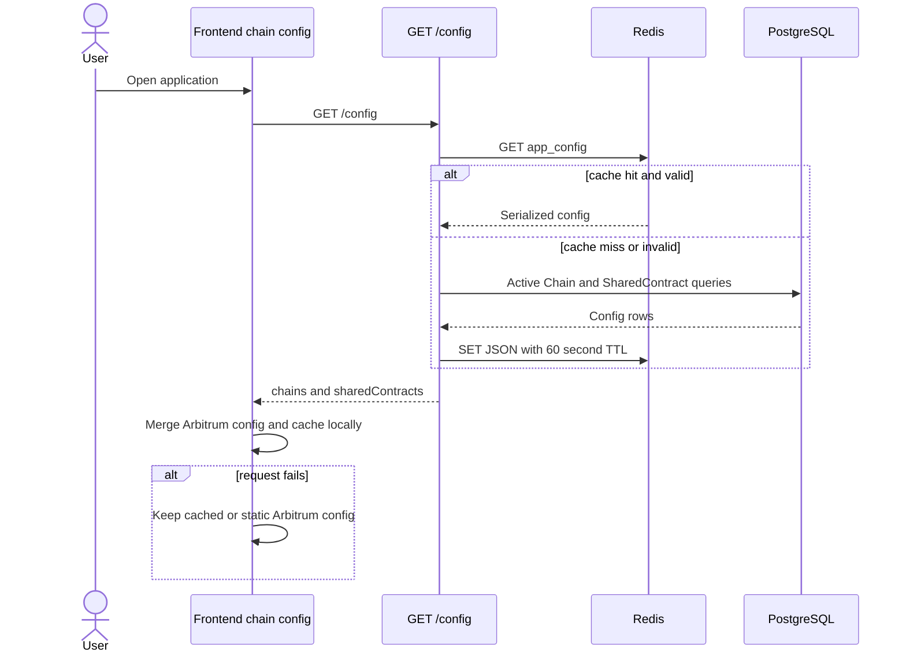
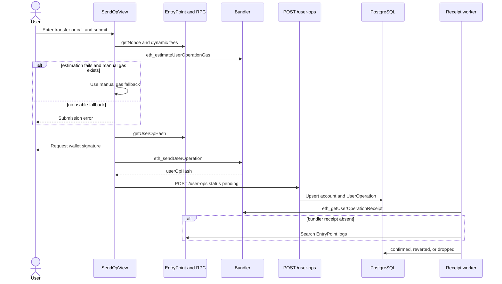
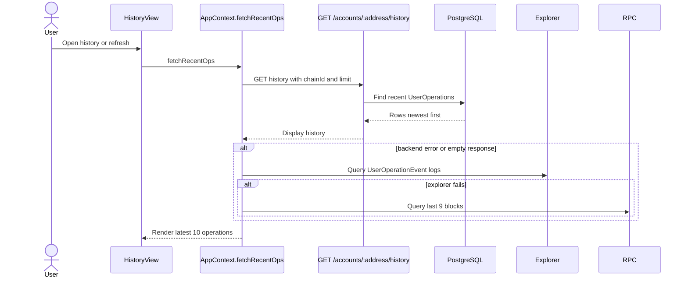
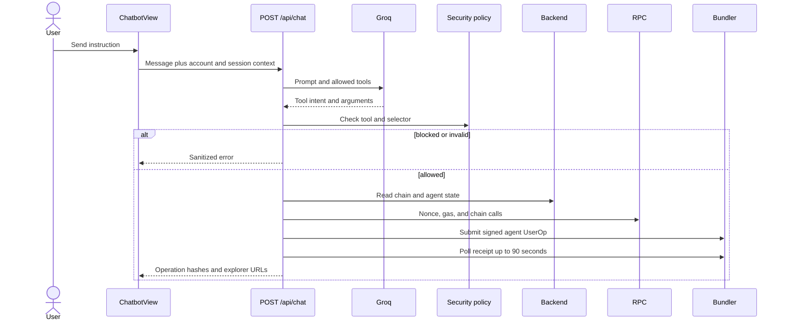
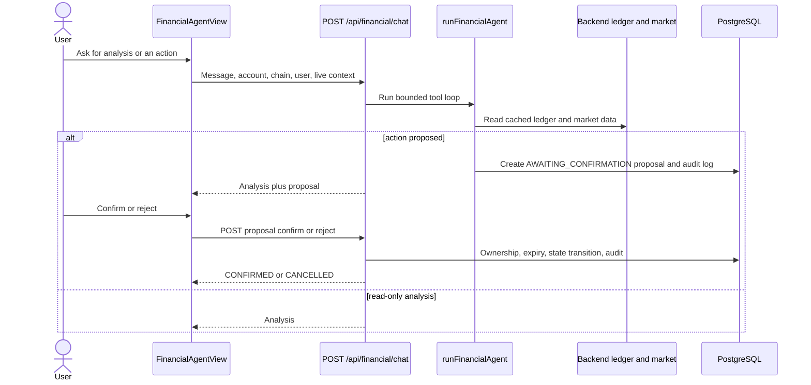

# AA Smart Wallet — Onboarding and Railway Runbook

Repository state reviewed: 2026-10-07. Source citations use `path:line`. Commands assume the repository root unless a preceding `cd` changes it. Never copy real keys into tickets, logs, or source control.

## 1. OVERVIEW

The repository is a JavaScript/TypeScript monorepo for an ERC-4337 smart wallet and agent-assisted DeFi UI (`package.json:12-40`, `frontend/package.json:12-40`).
The React 19/Vite frontend talks to a NestJS API, an Express chatbot, a separate Express financial agent, chain RPCs, a bundler, and explorer APIs (`frontend/src/config/chains.js:35-186`, `frontend/src/utils/backendApi.js:31-161`).
The NestJS API owns application configuration, smart-account/UserOperation persistence, ledger sync, indexing, receipt reconciliation, health, and admin endpoints (`apps/backend/src/app.module.ts:18-35`).
PostgreSQL is the durable source of truth; Redis is an optional backend config cache and a financial-agent cache (`apps/backend/prisma/schema.prisma:5-8`, `apps/backend/src/redis/redis.service.ts:85-104`).
The current runtime surface is restricted to Arbitrum Sepolia chain ID `421614`, despite dormant Sepolia/Amoy definitions (`frontend/src/config/chains.js:276-303`, `financial-agent/server.js:81-89`).

### Prerequisites

| Tool | Required version | Check command | Evidence |
|---|---:|---|---|
| Node.js | 20.x recommended; Docker images pin 20 Alpine | `node --version` | `apps/backend/Dockerfile:1`, `chatbot-server/Dockerfile:1`, `financial-agent/Dockerfile:1` |
| npm | Version bundled with Node 20; exact version is UNVERIFIED | `npm --version` | All five lockfiles use lockfile v3; no package declares `engines` |
| Docker Engine + Compose v2 | Version UNVERIFIED | `docker --version` and `docker compose version` | `docker-compose.yml:1-67` |
| PostgreSQL | 16 when using Compose | `docker compose exec postgres psql --version` | `docker-compose.yml:2-11` |
| Redis | 7 when using Compose | `docker compose exec redis redis-server --version` | `docker-compose.yml:13-16` |
| Git | Version UNVERIFIED | `git --version` | Required to clone; no version is declared |
| Railway CLI | Current compatible release; exact version UNVERIFIED | `railway --version` | No Railway manifest or CLI version is checked in |
| Optional Foundry | Version UNVERIFIED | `forge --version` | `forge-std` is a root dependency (`package.json:23`) |

The README's EntryPoint/package claims are stale: it describes EntryPoint v0.6 and `@account-abstraction/contracts` 0.6 (`README.md:3-9`, `README.md:31-37`), while the manifest installs `@account-abstraction/contracts` 0.7 and Hardhat 3 (`package.json:24`, `package.json:30`). Treat the manifest and deployed configuration as authoritative until the README is reconciled.

## 2. LOCAL SETUP (ZERO TO RUNNING)

### macOS/Linux

```bash
git clone <REPOSITORY_URL>
cd Account-abstraction-With-frontend

cp .env.example .env
cp apps/backend/.env.example apps/backend/.env
cp chatbot-server/.env.example chatbot-server/.env
cp financial-agent/.env.example financial-agent/.env
cp frontend/.env.example frontend/.env

docker compose up -d postgres redis
docker compose exec postgres pg_isready -U aa_wallet -d aa_wallet
docker compose exec redis redis-cli ping

npm ci
npm ci --prefix apps/backend
npm ci --prefix chatbot-server
npm ci --prefix financial-agent
npm ci --prefix frontend

cd apps/backend
npx prisma generate
npx prisma migrate dev
npm run prisma:seed
npm run start:dev
```

Open three more terminals from the repository root:

```bash
cd chatbot-server
node server.js
```

```bash
cd financial-agent
npm run dev
```

```bash
cd frontend
npm run dev
```

Success signals:

| Step | Signal | Evidence |
|---|---|---|
| Postgres | `accepting connections` from `pg_isready` | Compose exposes `5432` (`docker-compose.yml:8-11`) |
| Redis | `PONG` | Compose exposes `6379` (`docker-compose.yml:13-16`) |
| Backend | `GET http://127.0.0.1:3001/health` returns `status: ok` | `apps/backend/src/main.ts:73-75`, `apps/backend/src/health/health.service.ts:15-21` |
| Chatbot | Console says it listens on the selected port; `/health` returns JSON | `chatbot-server/server.js:181-193`, `chatbot-server/server.js:928-930` |
| Financial agent | `[Financial Agent] Listening on http://127.0.0.1:3003` | `financial-agent/server.js:324-347` |
| Frontend | Vite prints a local URL, normally `http://localhost:5173` | `frontend/package.json:6-10`; allowed by local CORS examples (`apps/backend/.env.example:5`) |

The backend seed is idempotent upsert logic (`apps/backend/prisma/seed.ts:7-63`). It seeds all static chain rows, but the public config returns only active Arbitrum Sepolia (`apps/backend/src/config/static-config.ts:124-155`).

### Windows PowerShell

```powershell
git clone <REPOSITORY_URL>
Set-Location Account-abstraction-With-frontend

Copy-Item .env.example .env
Copy-Item apps/backend/.env.example apps/backend/.env
Copy-Item chatbot-server/.env.example chatbot-server/.env
Copy-Item financial-agent/.env.example financial-agent/.env
Copy-Item frontend/.env.example frontend/.env

docker compose up -d postgres redis
docker compose exec postgres pg_isready -U aa_wallet -d aa_wallet
docker compose exec redis redis-cli ping

npm ci
npm ci --prefix apps/backend
npm ci --prefix chatbot-server
npm ci --prefix financial-agent
npm ci --prefix frontend

Set-Location apps/backend
npx prisma generate
npx prisma migrate dev
npm run prisma:seed
npm run start:dev
```

Run the chatbot, financial agent, and frontend commands from separate PowerShell windows as shown above; the commands are cross-platform.

### Local configuration rules

1. Populate only placeholders needed for the journey being tested. The backend can start without Redis, but readiness reports it as disabled (`apps/backend/src/health/health.service.ts:43-46`).
2. Do not put private keys in `VITE_*` variables. Vite values are browser-visible at build time. The sample currently lists four private-key-shaped variables (`frontend/.env.example:12-16`); leave them empty and remove this pattern before production.
3. Set frontend service URLs to local origins: `VITE_CONFIG_API_URL=http://127.0.0.1:3001`, `VITE_CHATBOT_API_URL=http://127.0.0.1:3002`, and `VITE_FINANCIAL_AGENT_URL=http://127.0.0.1:3003` (`frontend/.env.example:50-52`).
4. Set chatbot `PORT=3002`; its code fallback is incorrectly `3001`, which collides with the backend (`chatbot-server/.env.example:1`, `chatbot-server/server.js:928`).
5. Do not run `financial-agent`'s `npm run db:push` against shared or production data. The backend owns the checked-in migration (`apps/backend/package.json:14-16`, `apps/backend/prisma/migrations/20261001113500_init_with_ledger/migration.sql:2-282`).

### Development workflow

| Scope | Command | Expected result / caveat | Source |
|---|---|---|---|
| Contracts | `npx hardhat compile` | Solidity 0.8.27, viaIR, Cancun build | `hardhat.config.ts:12-25` |
| Contracts | `npx hardhat test` | Runs Hardhat tests if present; no `test/` contract suite is currently tracked | `package.json:5-7` |
| Frontend lint | `npm run lint --prefix frontend` | ESLint exits 0 | `frontend/package.json:6-10` |
| Frontend build | `npm run build --prefix frontend` | Vite creates `frontend/dist/` | `frontend/package.json:8` |
| Frontend typecheck | UNVERIFIED: no typecheck script and source is JS/JSX | Add a declared checker before gating CI | `frontend/package.json:6-10` |
| Backend lint | `npm run lint --prefix apps/backend` | ESLint exits 0 | `apps/backend/package.json:12` |
| Backend tests | `npm test --prefix apps/backend -- --runInBand` | Jest exits 0 | `apps/backend/package.json:13` |
| Backend schema | `npm run prisma:validate --prefix apps/backend` | Prisma schema valid | `apps/backend/package.json:15` |
| Backend build | `npm run build --prefix apps/backend` | Nest emits `dist/` | `apps/backend/package.json:7` |
| Chatbot tests | `npm test --prefix chatbot-server` | Node characterization tests exit 0 | `chatbot-server/package.json:6-8` |
| Chatbot lint/build | UNVERIFIED: no scripts exist | Do not invent CI gates | `chatbot-server/package.json:6-8` |
| Financial agent | `npm run db:generate --prefix financial-agent` | Generates its Prisma client | `financial-agent/package.json:6-11` |
| Financial tests/lint/build | UNVERIFIED: no scripts exist | Add before production gating | `financial-agent/package.json:6-11` |

Local-only database reset destroys the Compose database volume:

```bash
docker compose down -v
docker compose up -d postgres redis
npm run prisma:validate --prefix apps/backend
cd apps/backend && npx prisma migrate dev && npm run prisma:seed
```

PowerShell uses the same commands. Never run this reset against Railway or any shared environment.

### Smoke test

```bash
curl -fsS http://127.0.0.1:3001/health
curl -fsS http://127.0.0.1:3001/health/ready
curl -fsS http://127.0.0.1:3001/config
curl -fsS http://127.0.0.1:3002/health
curl -fsS http://127.0.0.1:3003/health
curl -I http://127.0.0.1:5173/
docker compose exec postgres psql -U aa_wallet -d aa_wallet -c 'SELECT COUNT(*) FROM "Chain";'
docker compose exec redis redis-cli ping
```

Expected: all `curl -f` calls exit 0, backend readiness includes database/config checks, the chain count is non-zero after seeding, and Redis returns `PONG` (`apps/backend/src/health/health.service.ts:24-54`). This proves service reachability and dependencies; an actual UserOperation also needs valid public RPC/bundler/contract configuration.

## 3. ENVIRONMENT VARIABLES

`Required?` means required for the service's intended production behavior, not merely for the process to bind a port. `Secret?` means the value must be sealed/restricted. All frontend `VITE_*` values are build-time and browser-public.

### Frontend (build-time)

| Variable | Required? | Secret? | Used in | Local value | Railway value | Purpose |
|---|---|---:|---|---|---|---|
| `VITE_CONFIG_API_URL` | Yes | No | `frontend/src/config/chains.js:191-249`; `frontend/src/utils/backendApi.js:1-11` | `http://127.0.0.1:3001` | `https://${{backend.RAILWAY_PUBLIC_DOMAIN}}` | Backend/config API base |
| `VITE_CHATBOT_API_URL` | Yes | No | `frontend/src/context/ChatbotContext.jsx:9`; `frontend/src/views/ChatbotView.jsx:635` | `http://127.0.0.1:3002` | `https://${{chatbot.RAILWAY_PUBLIC_DOMAIN}}` | Chatbot base |
| `VITE_FINANCIAL_AGENT_URL` | Yes | No | `frontend/src/context/AppContext.jsx:29`; `frontend/src/views/FinancialAgentView.jsx:12` | `http://127.0.0.1:3003` | `https://${{financial-agent.RAILWAY_PUBLIC_DOMAIN}}` | Financial API base |
| `VITE_ARBITRUM_SEPOLIA_RPC_URL` | Yes | Treat as secret if keyed | `frontend/src/config/chains.js:141-161` | Public or restricted testnet RPC | Provider URL suitable for browser use | Browser RPC; baked into bundle |
| `VITE_ARBITRUM_SEPOLIA_BUNDLER_URL` | Yes for UserOps | Treat as secret if keyed | `frontend/src/config/chains.js:142` | Testnet bundler URL | Browser-usable bundler URL | ERC-4337 JSON-RPC |
| `VITE_ARBITRUM_SEPOLIA_EXPLORER_URL` | No | No | `frontend/src/config/chains.js:5` | `https://sepolia.arbiscan.io` | Same | Explorer base |
| `VITE_ARBITRUM_SEPOLIA_PRICE_FEED` | No | No | `frontend/src/config/chains.js:153` | Public contract address | Same deployed address | Feed override |
| `VITE_ENTRY_POINT` | Yes | No | `frontend/src/config/chains.js:14-26` | Deployed address | Production environment address | Shared contract |
| `VITE_CREATE3FACTORY` | If account setup needs it | No | `frontend/src/config/chains.js:16` | Deployed address | Production environment address | CREATE3 factory |
| `VITE_K1_VALIDATOR_FACTORY` | Yes for account creation | No | `frontend/src/config/chains.js:17` | Deployed address | Production environment address | `FACTORY` mapping |
| `VITE_OLD_EOA_FACTORY` | No | No | `frontend/src/config/chains.js:18` | Optional address | Optional address | Legacy factory |
| `VITE_NEXUS_IMPLEMENTATION` | Yes for account creation | No | `frontend/src/config/chains.js:19` | Deployed address | Production environment address | Nexus implementation |
| `VITE_NEXUS_BOOTSTRAP` | Yes for account creation | No | `frontend/src/config/chains.js:20` | Deployed address | Production environment address | Bootstrap helper |
| `VITE_K1_VALIDATOR` | Yes | No | `frontend/src/config/chains.js:21` | Deployed address | Production environment address | K1 validator |
| `VITE_SESSION_KEY_VALIDATOR` | Yes for agents | No | `frontend/src/config/chains.js:22` | Deployed address | Production environment address | Session-key module |
| `VITE_SOCIAL_RECOVERY_VALIDATOR` | If recovery UI used | No | `frontend/src/config/chains.js:23` | Deployed address | Production environment address | Recovery module |
| `VITE_WEBAUTHN_VALIDATOR` | If WebAuthn used | No | `frontend/src/config/chains.js:24` | Deployed address | Production environment address | WebAuthn module |
| `VITE_WEBAUTHN_VALIDATOR_OLD` | No | No | `frontend/src/config/chains.js:25` | Optional legacy address | Optional address | Legacy validator |
| `VITE_PAYMASTER` | If sponsorship used | No | `frontend/src/config/chains.js:149-157` | Deployed address | Production environment address | Paymaster |
| `VITE_USDC_TOKEN` | Yes for token flows | No | `frontend/src/config/chains.js:151` | Deployed token address | Production environment address | Gas/DeFi token |
| `VITE_WETH_TOKEN` | If swap used | No | `frontend/src/config/chains.js:152` | Deployed token address | Production environment address | WETH |
| `VITE_AAVE_YIELD_POOL` | If Aave used | No | `frontend/src/config/chains.js:155` | Deployed address | Production environment address | Aave adapter/pool |
| `VITE_UNISWAP_ROUTER` | If swap used | No | `frontend/src/config/chains.js:156` | Deployed address | Production environment address | Swap router |
| `VITE_UNISWAP_QUOTER` | If quotes used | No | `frontend/src/config/chains.js:157` | Deployed address | Production environment address | Quote contract |
| `VITE_MULTISIG_PROXY` | If multisig used | No | `frontend/src/config/chains.js:154` | Deployed address | Production environment address | Multisig proxy |
| `VITE_ETHERSCAN_API_KEY` | Fallback only | Yes, but exposed | `frontend/src/context/AppContext.jsx:509-523` | Restricted browser key | Restricted browser key | Explorer history fallback; prefer backend history |
| `VITE_VERIFYING_SIGNER` | UNVERIFIED | Yes, unsafe if private | `frontend/src/context/AppContext.jsx:1477` | Public identifier only | Do not set if it is a secret | Name implies signer but usage needs security review |
| `VITE_SEPOLIA_RPC_URL`, `VITE_SEPOLIA_BUNDLER_URL`, `VITE_SEPOLIA_PRICE_FEED` | No; inactive | RPC may be keyed | `frontend/src/config/chains.js:37-66` | Empty | Empty | Dormant Sepolia config |
| `VITE_AMOY_RPC_URL`, `VITE_PIMLICO_BUNDLER_URL`, `VITE_SKANDHA_RPC_URL`, `VITE_MOCK_AGGREGATOR` | No; inactive | URLs may be keyed | `frontend/src/config/chains.js:28-33`, `frontend/src/config/chains.js:68-91` | Empty | Empty | Dormant Amoy/legacy config |

### Backend (runtime)

| Variable | Required? | Secret? | Used in | Local value | Railway value | Purpose |
|---|---|---:|---|---|---|---|
| `PORT` | Yes | No | `apps/backend/src/main.ts:73` | `3001` | `${{PORT}}` (Railway injects it; do not hardcode) | HTTP port |
| `HOST` | Yes on Railway | No | `apps/backend/src/main.ts:74` | `127.0.0.1` | `0.0.0.0` | Bind address |
| `DATABASE_URL` | Yes | Yes | `apps/backend/prisma/schema.prisma:5-8` | Compose URL from sample | `${{Postgres.DATABASE_URL}}` | Prisma/Postgres |
| `REDIS_URL` | Recommended | Yes | `apps/backend/src/redis/redis.service.ts:9-11` | `redis://localhost:6379` | `${{Redis.REDIS_URL}}` | Config/cache Redis |
| `CORS_ORIGINS` | Yes | No | `apps/backend/src/main.ts:18-24` | `http://127.0.0.1:5173,http://localhost:5173` | `https://${{frontend.RAILWAY_PUBLIC_DOMAIN}}` | Allowed browser origins |
| `CORS_ORIGIN` | No | No | `apps/backend/src/main.ts:19` | Empty | Omit | Singular fallback |
| `RATE_LIMIT_MAX` | Production: Yes | No | `apps/backend/src/main.ts:27-31` | `0` disables | Set an approved positive limit | In-memory per-instance limiter |
| `RATE_LIMIT_WINDOW_MS` | With rate limit | No | `apps/backend/src/main.ts:31` | `60000` | `60000` | Limiter window |
| `USEROP_RECEIPT_WORKER_ENABLED` | Yes | No | `apps/backend/src/receipts/receipts.service.ts:19` | `true` | `true` | Reconciliation worker |
| `USEROP_RECEIPT_POLL_INTERVAL_MS` | No | No | `apps/backend/src/receipts/receipts.service.ts:20` | `15000` | `15000` | Poll interval |
| `USEROP_RECEIPT_BATCH_SIZE` | No | No | `apps/backend/src/receipts/receipts.service.ts:21` | `25` | `25` | Pending batch size |
| `USEROP_RECEIPT_STALE_MINUTES` | No | No | `apps/backend/src/receipts/receipts.service.ts:22` | `20` | `20` | Drop timeout |
| `USEROP_RECEIPT_FALLBACK_BLOCKS` | No | No | `apps/backend/src/receipts/receipts.service.ts:23` | `150` | `150` | EntryPoint log lookback |
| `USEROP_INDEXER_ENABLED` | Yes | No | `apps/backend/src/indexer/indexer.service.ts:12` | `true` | `true` | Event indexer |
| `USEROP_INDEXER_POLL_INTERVAL_MS` | No | No | `apps/backend/src/indexer/indexer.service.ts:13` | `30000` | `30000` | Poll interval |
| `USEROP_INDEXER_CONFIRMATIONS` | No | No | `apps/backend/src/indexer/indexer.service.ts:14` | `2` | `2` | Reorg buffer |
| `USEROP_INDEXER_BLOCK_RANGE` | No | No | `apps/backend/src/indexer/indexer.service.ts:15` | `150` | `150` | RPC query range |
| `USEROP_INDEXER_START_LOOKBACK_BLOCKS` | No | No | `apps/backend/src/indexer/indexer.service.ts:16` | `300` | `300` | Initial lookback |
| `PUBLIC_ARBITRUM_SEPOLIA_RPC_URL` | Yes | No; must be browser-safe | `apps/backend/src/config/static-config.ts:124-130` | Public testnet RPC | Browser-public RPC URL | Returned by `/config` |
| `PUBLIC_ARBITRUM_SEPOLIA_BUNDLER_URL` | Yes for UserOps | No; must be browser-safe | `apps/backend/src/config/static-config.ts:129-130` | Testnet bundler URL | Browser-public bundler URL | Returned by `/config` |
| `PUBLIC_ARBITRUM_SEPOLIA_EXPLORER_URL` | No | No | `apps/backend/src/config/config.service.ts:9-10` | `https://sepolia.arbiscan.io` | Same | Public explorer |
| `ENTRY_POINT`, `CREATE3_FACTORY`, `FACTORY`, `OLD_EOA_FACTORY`, `NEXUS_IMPLEMENTATION`, `NEXUS_BOOTSTRAP` | According to enabled flows | No | `apps/backend/src/config/static-config.ts:13-19` | Deployed addresses | Same environment addresses | Shared contracts |
| `K1_VALIDATOR`, `SESSION_KEY_VALIDATOR`, `SOCIAL_RECOVERY_VALIDATOR`, `WEBAUTHN_VALIDATOR`, `WEBAUTHN_VALIDATOR_OLD` | According to enabled flows | No | `apps/backend/src/config/static-config.ts:20-24` | Deployed addresses | Same environment addresses | Validator contracts |
| `PAYMASTER`, `USDC_TOKEN`, `WETH_TOKEN`, `ARBITRUM_SEPOLIA_PRICE_FEED`, `MULTISIG_PROXY`, `AAVE_YIELD_POOL`, `UNISWAP_ROUTER`, `UNISWAP_QUOTER` | According to enabled flows | No | `apps/backend/src/config/static-config.ts:137-145` | Deployed addresses | Same environment addresses | Per-chain contracts |
| `PUBLIC_SEPOLIA_RPC_URL`, `PUBLIC_SEPOLIA_BUNDLER_URL`, `SEPOLIA_PRICE_FEED` | No; inactive | URL may be keyed | `apps/backend/src/config/static-config.ts:27-52` | Empty | Omit | Dormant Sepolia config |
| `PUBLIC_AMOY_RPC_URL`, `PUBLIC_AMOY_BUNDLER_URL`, `MOCK_AGGREGATOR` | No; inactive | URL may be keyed | `apps/backend/src/config/static-config.ts:54-73` | Empty | Omit | Dormant Amoy config |
| `PRISMA_SEED_MODE` | Start script only | No | `apps/backend/prisma/seed.ts:5` | Omit for normal seed | `bootstrap` in container startup | Prevents overwriting admin changes |

### Chatbot (runtime)

| Variable | Required? | Secret? | Used in | Local value | Railway value | Purpose |
|---|---|---:|---|---|---|---|
| `PORT` | Yes | No | `chatbot-server/server.js:928` | `3002` | `${{PORT}}` | HTTP port |
| `GROQ_API_KEY` | Yes for chat | Yes | `chatbot-server/server.js:82` | `<groq-key>` | Sealed value | LLM API |
| `AGENT_STORE_API_URL` | Yes | No | `chatbot-server/server.js:86` | `http://127.0.0.1:3001` | `http://${{backend.RAILWAY_PRIVATE_DOMAIN}}` | Backend private URL |
| `CONFIG_API_URL` | No | No | `chatbot-server/server.js:86` | Empty | Omit | Backend URL fallback |
| `CHATBOT_CORS_ORIGINS` | Yes | No | `chatbot-server/server.js:33-38` | Frontend local origins | `https://${{frontend.RAILWAY_PUBLIC_DOMAIN}}` | Allowed origins |
| `CORS_ORIGINS` | No | No | `chatbot-server/server.js:35` | Empty | Omit | CORS fallback |
| `JSON_BODY_LIMIT` | No | No | `chatbot-server/server.js:67` | `1mb` | `1mb` | JSON limit |
| `RATE_LIMIT_MAX`, `RATE_LIMIT_WINDOW_MS` | Production: Yes | No | `chatbot-server/server.js:40-44` | `0`, `60000` | Approved limit, `60000` | In-memory limiter |
| `ARBITRUM_SEPOLIA_RPC_URL` | Yes | Yes if keyed | `chatbot-server/server.js:23-25` | Testnet RPC | Sealed RPC | Server-side chain RPC |
| `ARBITRUM_SEPOLIA_EXPLORER_URL` | No | No | `chatbot-server/server.js:25` | `https://sepolia.arbiscan.io` | Same | Result links |
| `BUNDLER_URL` | Yes for execution | Yes if keyed | `chatbot-server/userOpBuilder.js:145-146`, `chatbot-server/server.js:497` | Testnet bundler URL | Sealed URL | UserOp JSON-RPC |
| `ENTRY_POINT`, `SESSION_KEY_VALIDATOR` | Yes for agents | No | `chatbot-server/server.js:781-889` | Deployed addresses | Same environment addresses | AA validation |
| `UNISWAP_ROUTER`, `WETH_TOKEN`, `USDC_TOKEN`, `AAVE_YIELD_POOL` | For corresponding tools | No | `chatbot-server/server.js:657-707` | Deployed addresses | Same environment addresses | Tool targets |
| `ERC20PAYMASTER`, `PAYMASTER`, `GAS_TOKEN_ADDRESS` | For sponsored gas | No | `chatbot-server/server.js:803-804` | Deployed addresses | Environment-specific values | Paymaster routing |
| `SEPOLIA_RPC_URL`, `WETH_SEPOLIA`, `USDC_SEPOLIA` | No; legacy fallbacks | RPC may be keyed | `chatbot-server/server.js:24`, `chatbot-server/server.js:659-706` | Empty | Omit | Legacy names |

### Financial agent (runtime)

| Variable | Required? | Secret? | Used in | Local value | Railway value | Purpose |
|---|---|---:|---|---|---|---|
| `PORT`, `HOST` | Yes | No | `financial-agent/server.js:324-325` | `3003`, `127.0.0.1` | `${{PORT}}`, `0.0.0.0` | HTTP bind |
| `NODE_ENV` | No | No | `financial-agent/db/prismaClient.js:14` | `development` | `production` | Prisma logging |
| `GROQ_API_KEY` | Yes for chat | Yes | `financial-agent/agent/financialAgent.js:27` | `<groq-key>` | Sealed value | LLM API |
| `GROQ_MODEL` | No | No | `financial-agent/agent/financialAgent.js:28` | `openai/gpt-oss-120b` | Same or approved model | Model selection |
| `DATABASE_URL` | Yes | Yes | `financial-agent/prisma/schema.prisma:15-18` | Same local Postgres | `${{Postgres.DATABASE_URL}}` | Shared database |
| `REDIS_URL` | Recommended | Yes | `financial-agent/db/redisClient.js:13` | `redis://localhost:6379` | `${{Redis.REDIS_URL}}` | Market/quote cache |
| `BACKEND_API_URL` | Yes | No | `financial-agent/db/backendClient.js:10` | `http://localhost:3001` | `http://${{backend.RAILWAY_PRIVATE_DOMAIN}}` | Ledger/market source |
| `ARBITRUM_SEPOLIA_RPC_URL` | Yes | Yes if keyed | `financial-agent/config/chains.js:78-84` | Testnet RPC | Sealed RPC | Server-side reads |
| `ARBITRUM_SEPOLIA_BUNDLER_URL` | No in current read/prepare flow | Yes if keyed | `financial-agent/config/chains.js:84` | Empty | Optional sealed URL | Future submission |
| `CORS_ORIGINS` | Yes | No | `financial-agent/server.js:35-42` | Frontend local origins | `https://${{frontend.RAILWAY_PUBLIC_DOMAIN}}` | Allowed origins |
| `AGENT_MAX_TOOL_ITERATIONS` | No | No | `financial-agent/agent/financialAgent.js:29` | `8` | `8` | LLM tool-loop cap |
| `TRANSACTION_PROPOSAL_TTL_SECONDS` | No | No | `financial-agent/transactions/proposalService.js:12` | `300` | `300` | Confirmation expiry |
| `CHAINLINK_MAX_PRICE_AGE_SECONDS` | No | No | `financial-agent/financial/chainlinkPriceService.js:20` | `3600` | `3600` | Stale-price threshold |
| `AAVE_MARKET_DATA_CACHE_SECONDS` | No | No | `financial-agent/defi/aave/aaveService.js:12` | `300` | `300` | Aave cache TTL |
| `UNISWAP_QUOTE_CACHE_SECONDS` | No | No | `financial-agent/defi/uniswap/uniswapQuoteService.js:14` | `15` | `15` | Quote cache TTL |
| `ETHEREUM_SEPOLIA_RPC_URL`, `ETHEREUM_SEPOLIA_BUNDLER_URL`, `POLYGON_AMOY_RPC_URL`, `POLYGON_AMOY_BUNDLER_URL` | No; chains are commented out | Yes if keyed | `financial-agent/config/chains.js:35-73`, `financial-agent/config/chains.js:111-139` | Empty | Omit | Dormant configurations |
| `AGENT_PRIVATE_KEY` | Test script only; never service runtime | Yes | `financial-agent/scripts/testAaveDeposit.js:21-27` | Leave empty | Never set on service | Fund-moving test key |

### Database, Redis, and contract tooling

Compose local credentials are `aa_wallet`/`aa_wallet` and must never be reused outside local development (`docker-compose.yml:2-11`). Railway-provided `Postgres.DATABASE_URL` and `Redis.REDIS_URL` should be referenced, not copied.

Root `.env.example` is limited to Arbitrum Sepolia contract/deployment
tooling: the RPC URL, deployment signer, Arbiscan key, and public deployed
contract addresses. `PRIVATE_KEY` is consumed by the configured Hardhat
network and must remain local or in a protected CI secret; it never belongs in
frontend or general web-service Railway variables.

Differences between local and Railway:

- Railway injects `PORT`; every service must bind it and use `HOST=0.0.0.0`. Local services bind their documented fixed ports (`apps/backend/src/main.ts:73-75`, `financial-agent/server.js:324-345`).
- Internal calls use Railway private domains; the browser requires public HTTPS domains.
- CORS must use the frontend's generated public origin, not localhost.
- `VITE_*` values are required during the frontend build and become immutable in that artifact; changing them requires redeploying the frontend.
- Railway database/cache URLs are secrets and references; local URLs target Compose.

## 4. RAILWAY DEPLOYMENT

No `railway.json`, `railway.toml`, `nixpacks.toml`, `Procfile`, or CI workflow is tracked. The table below is a repository-derived deployment plan, not an existing deployment declaration.

### Service topology

| Service | Source/build context | Dockerfile/build | Start | Healthcheck | Network |
|---|---|---|---|---|---|
| `frontend` | Repository root `/` | `npm ci --prefix frontend && npm run build --prefix frontend` | `npm run preview --prefix frontend -- --host 0.0.0.0 --port $PORT` | `/` | Public |
| `backend` | Repository root `/` | Dockerfile `/apps/backend/Dockerfile` | Image CMD `npm run start:container` | `/health/ready` | Public for browser API; private for sidecars |
| `chatbot` | Repository root `/` | Dockerfile `/chatbot-server/Dockerfile` | Image CMD `node server.js` | `/health` | Public for browser |
| `financial-agent` | Root `/financial-agent` | Detected `Dockerfile` | Override with `npm start` | `/health` | Public for browser; private to backend/data |
| `Postgres` | Railway database | Managed | Managed | Managed | Private only |
| `Redis` | Railway database | Managed | Managed | Managed | Private only |

Why root context matters: backend copies `packages/action-tags` and `apps/backend` (`apps/backend/Dockerfile:5-13`); chatbot does the same (`chatbot-server/Dockerfile:3-11`). The frontend also declares `file:../packages/action-tags` (`frontend/package.json:13`).

The frontend start command uses Vite preview because no production server or static-hosting declaration exists (`frontend/package.json:6-10`). **UNVERIFIED:** approve this for low-volume demo use or add a production static-server/container before a production launch. The financial Dockerfile currently starts `npm run dev` (`financial-agent/Dockerfile:17`), so Railway must override it with `npm start` (`financial-agent/package.json:7-8`).

### Deployment steps

1. Create a Railway project and a `production` environment; connect this Git repository.
2. Add managed PostgreSQL and Redis services.
3. Create the four application services in the topology table. Keep backend/chatbot/frontend at repository root; set `RAILWAY_DOCKERFILE_PATH` for the two Docker services. Railway supports custom Dockerfile paths and monorepo service roots ([Dockerfiles](https://docs.railway.com/builds/dockerfiles), [Monorepos](https://docs.railway.com/deployments/monorepo)).
4. Add variables from Section 3. Use reference syntax `${{SERVICE_NAME.VAR}}`; Railway documents this exact form ([Variables reference](https://docs.railway.com/variables/reference)). Seal API keys and keyed RPC/bundler URLs.
5. Generate public domains for frontend, backend, chatbot, and financial-agent. Do not expose Postgres or Redis.
6. Set backend pre-deploy command to `npx prisma migrate deploy`. The image contains Prisma and generated client (`apps/backend/Dockerfile:15-19`). A failed Railway pre-deploy command prevents the release ([Pre-deploy commands](https://docs.railway.com/deployments/pre-deploy-command)).
7. Keep the backend startup's bootstrap seed, or split it into a separately reviewed pre-deploy command. Its current container script runs migration retry, then `PRISMA_SEED_MODE=bootstrap npx prisma db seed` (`apps/backend/scripts/start-container.sh:7-22`). Running migration both pre-deploy and at start is redundant but idempotent.
8. Deploy backend first, then sidecars, then frontend. Verify the smoke tests using generated domains.

Recommended post-first-deploy config-as-code work:

```json
{
  "$schema": "https://railway.com/railway.schema.json",
  "deploy": {
    "healthcheckPath": "/health/ready",
    "healthcheckTimeout": 300,
    "preDeployCommand": ["npx prisma migrate deploy"],
    "restartPolicyType": "ON_FAILURE"
  }
}
```

Place service-specific files only after validating how Railway resolves them with the required root build contexts. The checked-in repository currently has none; this snippet is a recommendation, not current behavior. Railway's config schema supports these fields ([Config as Code](https://docs.railway.com/config-as-code/reference)).

### Networking



The frontend learns public service URLs from build-time `VITE_*` variables. Chatbot and financial-agent use backend private networking (`chatbot-server/server.js:86`, `financial-agent/db/backendClient.js:10`).

### Redeploy, rollback, logs, one-off commands

```bash
railway link
railway logs --service backend --environment production
railway logs --service backend --environment production --lines 100
railway logs --service backend --environment production --build --latest
railway run --service backend npx prisma migrate status
railway run --service backend npm run prisma:seed
```

`railway logs` supports service/environment selection and build/deploy history ([Railway logs](https://docs.railway.com/cli/logs)). Treat `prisma:seed` as a controlled operation: normal mode updates stored chain config; container bootstrap mode does not (`apps/backend/prisma/seed.ts:5-35`). Roll back by selecting the last known-good deployment in Railway's deployment history; a code rollback does **not** roll back an applied database migration. No down migrations are provided.

### Troubleshooting

| Symptom | Likely cause | Fix |
|---|---|---|
| Healthcheck timeout / connection refused | Process bound to loopback or ignored Railway `PORT` | Set `HOST=0.0.0.0`; do not override injected `PORT` (`apps/backend/src/main.ts:73-75`) |
| Backend image build cannot find `packages/action-tags` | Railway root set to `apps/backend` | Use repository root context and `/apps/backend/Dockerfile` |
| Chatbot starts on backend port | `PORT` absent locally; code defaults to 3001 | Set local `PORT=3002`; Railway injects its own port (`chatbot-server/server.js:928`) |
| Browser CORS error | Generated frontend domain missing from origins | Set exact `https://...` origin in each service; redeploy runtime services |
| Frontend still calls old URL | `VITE_*` changed without rebuilding | Redeploy frontend; Vite variables are build-time |
| Prisma `P1001` / migration cannot connect | Wrong DB reference/private networking not ready | Use `${{Postgres.DATABASE_URL}}`; inspect backend pre-deploy logs |
| Postgres SSL error | Manually assembled URL or provider mismatch | Use Railway's supplied `DATABASE_URL` unchanged |
| Backend readiness says Redis disabled/error | Missing/wrong `REDIS_URL` | Use `${{Redis.REDIS_URL}}`; Redis is optional for basic reads but readiness reports status |
| `/config` contains fallback/empty contracts | DB not seeded or env addresses absent | Inspect seed logs; run bootstrap seed after supplying public contract addresses |
| UserOps remain pending | Bundler URL/RPC/EntryPoint wrong or worker disabled | Check `USEROP_RECEIPT_*`, `USEROP_INDEXER_*`, chain rows, and backend logs |
| Financial deploy mutates/drops shared schema | `prisma db push` used from divergent sidecar schema | Stop; restore backup if needed; use backend `prisma migrate deploy` only |
| Health is green but chat fails | Health endpoints do not check Groq/RPC/bundler | Verify sealed keys and run a non-fund-moving test request |

## 5. ARCHITECTURE AND RESPONSIBILITIES

| Layer/service | Responsibilities | Does NOT do | Talks to |
|---|---|---|---|
| Frontend | Wallet connection, smart-account UI, UserOp construction/signing/submission, history/dashboard rendering, agent UI | Own durable data; keep secrets; execute financial proposals server-side | Backend, chatbot, financial agent, wallet, bundler/RPC/explorer |
| Backend controllers | Parse/validate HTTP input and route requests | Direct business rules except two controller-to-repository ledger reads that should be refactored | Services; currently `AccountsRepository` in ledger route (`apps/backend/src/accounts/accounts.controller.ts:55-68`) |
| Backend services | Config, account/UserOp behavior, sync, indexing, receipts, health, observability | Hold private signing keys; browser rendering | Repositories, Redis, RPC/bundler |
| Backend repositories | Prisma queries and idempotent upserts | HTTP parsing or UI logic | PostgreSQL |
| Chatbot | Groq tool planning, agent/session-key lifecycle, guarded UserOp construction and execution | Own canonical chain/account data | Backend, Groq, RPC, bundler |
| Financial agent | Read financial state, price/risk/quote analysis, create/confirm/reject proposals, audit events | Execute a confirmed proposal in current code | Backend, Groq, Postgres, Redis, RPC |
| PostgreSQL | Chains/contracts, accounts, session keys, UserOps, proposals, snapshots, audit, market cache | Cache ephemeral quote/config values | Backend and financial agent |
| Redis | Backend config cache; financial market/quote cache | Source of truth | Backend and financial agent |
| RPC/EntryPoint/bundler | On-chain reads, simulation/submission, inclusion receipts/events | Application persistence | Frontend, backend workers, agents |
| Groq | LLM inference/tool selection | Transaction authority or durable state | Chatbot and financial agent |

### Data ownership

The backend Prisma schema and its migration are the database authority (`apps/backend/prisma/schema.prisma:1-238`).

| Owner | Tables/models | Source of truth |
|---|---|---|
| Chain/config admin | `Chain`, `ChainContract`, `SharedContract`, `AdminUser` | PostgreSQL; static env config is startup/failure fallback (`apps/backend/src/config/config.service.ts:60-86`) |
| Future auth | `SiweSession` | PostgreSQL; no auth routes/guards are present |
| Accounts/modules | `SmartAccount`, `Guardian`, `SessionKey` | PostgreSQL metadata plus chain for deployed/module/balance truth |
| UserOp pipeline | `UserOperation` | PostgreSQL status cache reconciled against bundler/EntryPoint |
| Multisig | `MultisigProposal` | PostgreSQL metadata; on-chain state remains authoritative |
| Financial agent | `TransactionProposal`, `FinancialSnapshot`, `FinancialAuditLog` | PostgreSQL; financial agent writes these models (`financial-agent/transactions/proposalService.js:42-70`, `financial-agent/transactions/proposalService.js:167-175`) |
| Market/ledger cache | SmartAccount ledger fields, `ChainMarketData` | PostgreSQL cache derived from chain reads (`apps/backend/src/accounts/accounts.repository.ts:50-107`) |

## 6. DIAGRAMS

### a) System context



### b) Module dependency graph



Imports supporting this graph include `apps/backend/src/accounts/accounts.controller.ts:9-10`, `apps/backend/src/accounts/accounts.service.ts:2`, `apps/backend/src/accounts/accounts.repository.ts:2`, `financial-agent/server.js:16-31`, and `chatbot-server/server.js:7-21`.

### c) Important call graphs



### d) ER diagram



The relationships and keys come from `apps/backend/prisma/schema.prisma:10-238` and the applied migration constraints at `apps/backend/prisma/migrations/20261001113500_init_with_ledger/migration.sql:219-282`.

## 7. END-TO-END OPERATION FLOWS

### Journey 1: Load dynamic chain configuration



1. `frontend/src/config/chains.js:240-274` starts the fetch and keeps a best-effort browser cache.
2. `apps/backend/src/config/config.controller.ts:5-12` routes the request.
3. `apps/backend/src/config/config.service.ts:40-86` reads Redis, queries Postgres, and falls back to static config on failure.
4. Retry is a page reload or `refreshRemoteConfig`; no exponential client retry exists.

### Journey 2: Submit and track a UserOperation



1. The view builds, estimates, optionally attaches a paymaster, signs, and submits (`frontend/src/views/SendOpView.jsx:185-268`).
2. `trackOp` immediately updates local UI and asynchronously persists (`frontend/src/context/AppContext.jsx:604-638`).
3. The backend validates and upserts the operation (`apps/backend/src/user-ops/user-ops.controller.ts:21-33`, `apps/backend/src/user-ops/user-ops.service.ts:17-39`).
4. The worker tries bundler receipt, falls back to EntryPoint logs, then marks stale operations dropped (`apps/backend/src/receipts/receipts.service.ts:67-97`). Each failed RPC call is retried on the next interval.

### Journey 3: View smart-account history



1. UI trigger: `frontend/src/views/HistoryView.jsx:7-55`.
2. Backend-first and explorer/RPC fallbacks: `frontend/src/context/AppContext.jsx:489-565`.
3. Controller → service → repository: `apps/backend/src/accounts/accounts.controller.ts:42-52`, `apps/backend/src/accounts/accounts.service.ts:26-36`, `apps/backend/src/accounts/accounts.repository.ts:39-47`.
4. Retry is manual refresh; fallback RPC intentionally covers only nine blocks.

### Journey 4: Chatbot prepares and executes an agent action



1. The chatbot defines tool/action tags and security modules at `chatbot-server/server.js:18-31`.
2. `/api/chat` begins at `chatbot-server/server.js:487`; successful operation results are assembled at `chatbot-server/server.js:895-920`.
3. Per-operation failure returns an error plus already-submitted results (`chatbot-server/server.js:910-913`). The UI must avoid blindly retrying the whole batch because partial execution is possible.

### Journey 5: Financial analysis and explicit proposal confirmation



1. Input validation and the agent call are at `financial-agent/server.js:107-134`.
2. Proposal creation/audit is at `financial-agent/transactions/proposalService.js:42-70`; confirmation validates ownership/status/expiry at `financial-agent/transactions/proposalService.js:78-105`.
3. UI confirmation only changes status (`frontend/src/views/FinancialAgentView.jsx:300-317`). **UNVERIFIED:** no current code advances `CONFIRMED` through revalidation/simulation/execution; the UI text correctly says the platform execution path *can now* submit it.
4. Expired proposals are swept at startup and every 60 seconds (`financial-agent/server.js:327-342`). A retry after expiry must create a new proposal.

## 8. OPERATIONS CHECKLIST

### Health and logging

- Backend liveness: `/health`; readiness: `/health/ready` checks SQL, Redis, and config (`apps/backend/src/health/health.controller.ts:5-17`, `apps/backend/src/health/health.service.ts:24-54`).
- Chatbot health: GET/POST `/health`, but it does not test Groq/RPC/bundler (`chatbot-server/server.js:181-193`).
- Financial health: `/health`, but it does not test Postgres/Redis/Groq/RPC (`financial-agent/server.js:96-105`).
- Backend logs every HTTP method, URL, status, and latency (`apps/backend/src/main.ts:54-66`). Sidecars log to stdout/stderr.
- Inspect Railway build logs first for dependency/Docker errors, deploy logs for runtime/port/env failures, backend readiness for dependencies, then RPC/bundler provider dashboards.

### Pre-deploy

- [ ] All changed manifests have matching lockfiles; use `npm ci`, not `npm install`, in deployment.
- [ ] Backend lint, tests, Prisma validate, and build pass.
- [ ] Frontend lint and build pass with production `VITE_*` values.
- [ ] Chatbot tests pass; financial-agent has a documented manual smoke test until tests exist.
- [ ] `npx prisma migrate deploy` is the only production schema mutation.
- [ ] Backup/restore procedure has been tested before schema changes.
- [ ] Contract addresses, chain ID, RPC chain, bundler EntryPoint version, and paymaster funding are verified without logging keys or full signatures.
- [ ] CORS lists only intended frontend domains; rate limits are non-zero and suitable for replica count.
- [ ] No `VITE_*` private key/API secret is present in the built bundle.
- [ ] Healthcheck paths and `HOST=0.0.0.0` are set.

### Post-deploy

- [ ] All four health/frontend URLs return 2xx.
- [ ] Backend `/health/ready` reports database/config OK and expected Redis status.
- [ ] `/config` exposes only browser-public values and active chain `421614`.
- [ ] Create/read a test smart-account record and verify history without a fund-moving operation.
- [ ] Run a read-only financial portfolio/market request.
- [ ] Run a chatbot read-only request; confirm public errors contain no raw signature/UserOp/key material.
- [ ] Submit one explicitly approved, low-value testnet UserOperation and verify pending → confirmed/reverted reconciliation.
- [ ] Check logs for repeated indexer, receipt, Redis, Prisma, CORS, or rate-limit failures.

### Security and key rotation

- Secrets: DB/Redis URLs, Groq keys, keyed RPC/bundler URLs, explorer keys, and every private/session/guardian key.
- Never commit `.env`; never place private keys in `VITE_*`; never log raw signatures, session keys, or full signed UserOperations.
- Rotate by adding the new sealed Railway value, redeploying the dependent service, verifying health/behavior, then revoking the old credential at the provider.
- Contract-owner/deployer key rotation is an on-chain operational procedure and is **UNVERIFIED** in this repository. Do not infer it from web-service redeployment.
- Authentication is not implemented despite `AdminUser` and `SiweSession` models. Admin/account endpoints are currently unguarded in the reviewed controller/module code. Do not expose the backend publicly for production until auth/authorization is completed or enforced at a trusted gateway.
- `SessionKey.privateKey` exists in the database schema (`apps/backend/prisma/schema.prisma:104-129`). **UNVERIFIED:** encryption-at-rest/application-level encryption and access controls are not present in the reviewed code; do not persist production private keys without an approved design.

## Gaps and UNVERIFIED items

- UNVERIFIED: exact Node/npm/Railway CLI versions; manifests have no `engines`, `.nvmrc`, or tool-version file.
- UNVERIFIED: Git remote URL and production Railway project/service names.
- UNVERIFIED: no Railway config-as-code, CI workflow, frontend production server, or automated financial-agent test/lint gate exists.
- UNVERIFIED: root README's v0.6 description conflicts with installed EntryPoint contract package v0.7 and current code; deployed EntryPoint version must be checked before any fund-moving operation.
- UNVERIFIED: frontend `.env.example` omits several variables actually read (`VITE_K1_VALIDATOR_FACTORY`, WETH/Aave/Uniswap overrides) and lists unused/private-key variables.
- UNVERIFIED: chatbot code defaults to port 3001 while its sample/Docker topology expects 3002.
- UNVERIFIED: financial-agent `FINANCIAL_AGENT_URL` wiring in chatbot; the sample declares it but current chatbot server does not consume it.
- UNVERIFIED: financial proposal execution after `CONFIRMED`; current code persists the transition but does not implement the remaining state-machine pipeline.
- UNVERIFIED: financial-agent Prisma schema claims to mirror backend but omits current SmartAccount ledger fields and `ChainMarketData`; do not use its `db push` on shared/production data.
- UNVERIFIED: production auth. `AdminUser`/`SiweSession` tables exist, but reviewed routes have no guards; backend `/admin/*` and `/accounts/*` must be protected before production.
- UNVERIFIED: rate limiting is process-local and will not coordinate across Railway replicas.
- UNVERIFIED: chatbot/financial healthchecks do not test dependencies, and no alerting, tracing, SLO, backup, restore, or disaster-recovery policy is checked in.
- UNVERIFIED: migrations consist of one timestamped initial migration dated 2026-10-01; confirm whether it has already been applied anywhere before changing schema.
- UNVERIFIED: no safe production reset or rollback migration exists; deployment rollback does not undo database changes.
